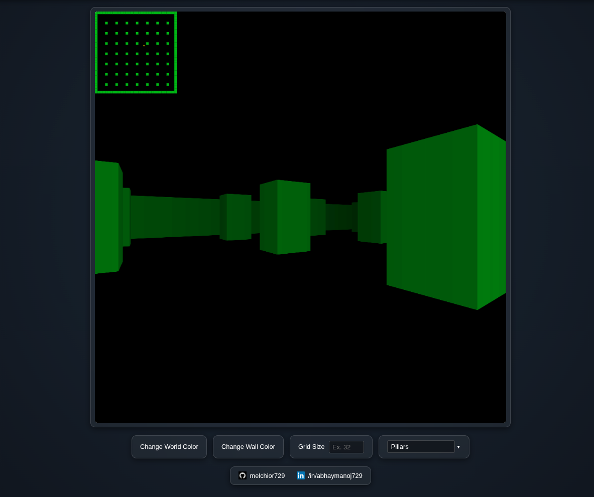

# Abhay's Raycaster

A lightweight, high-performance raycasting engine built from scratch using modern **Vanilla JavaScript** and the HTML5 **Canvas API**. This project demonstrates the mathematical principles behind retro 3D rendering (similar to *Wolfenstein 3D*) without external game engines or libraries.



## Mathematical Principles

This engine relies purely on vector mathematics and trigonometry to simulate 3D space on a 2D plane. Below is a breakdown of the core algorithms.

### 1. The Camera Plane & Ray Vectors
To cast rays, we define a 2D camera plane perpendicular to the player's direction vector.
* **Direction Vector ($\vec{d}$):** A normalized unit vector representing where the player is looking.
* **Camera Plane ($\vec{p}$):** A vector perpendicular to $\vec{d}$ that represents the screen surface.

For every vertical strip $x$ of the screen (where $x \in [-1, 1]$), the ray direction $\vec{r}$ is calculated as:

$$\vec{r} = \vec{d} + \vec{p} \cdot x$$

### 2. Digital Differential Analysis (DDA)
Raycasting by stepping fixed units is inefficient. DDA allows us to jump to the next grid line intersection in $O(N)$ complexity.

We derive the **Delta Distance** (distance the ray travels to cross one grid unit in either X or Y) using the Pythagorean theorem, which simplifies algebraically to:

* $\Delta x = \sqrt{1 + (r_y / r_x)^2} = | 1 / r_x |$
* $\Delta y = \sqrt{1 + (r_x / r_y)^2} = | 1 / r_y |$

The algorithm tracks `sideDistX` and `sideDistY` (distance to the *next* grid line) and increments grid coordinates one step at a time until a wall is hit.

### 3. Perpendicular Wall Distance (Fish-eye Correction)
Calculating the Euclidean distance from the player to the wall results in a "fish-eye" lens distortion. To solve this, we calculate the perpendicular distance to the camera plane.

If the ray hit a vertical wall (x-side):
$$\text{distance} = \frac{\text{mapX} - \text{playerX} + (1 - \text{stepX}) / 2}{\text{rayDirX}}$$

This projects the collision point onto the camera vector $\vec{d}$, ensuring walls look flat when viewed straight on.

### 4. Perspective Projection
Once the perpendicular distance ($dist$) is known, the height of the wall slice ($h$) on the screen is inversely proportional to the distance:

$$h_{line} = \frac{h_{screen}}{dist}$$

### 5. Rotation Matrices
Player rotation is handled by multiplying the direction and plane vectors by a 2D rotation matrix. For a rotation angle $\theta$:

$$
\begin{bmatrix}
x' \\
y'
\end{bmatrix} =
\begin{bmatrix}
\cos \theta & -\sin \theta \\
\sin \theta & \cos \theta
\end{bmatrix}
\begin{bmatrix}
x \\
y
\end{bmatrix}
$$

In the code, this is applied iteratively to both `directionVector` and the camera plane to maintain the FOV.

### 6. Illumination Falloff
Depth perception is enhanced via exponential fog. The opacity ($\alpha$) of the wall strip is calculated as a decay function of distance ($d$):

$$\alpha = 0.92^d$$

## Features

* **Core Raycasting Engine:** Custom DDA implementation.
* **Procedural Map Generation:**
    * **Pillars:** Modulo-based grid generation (`i % 4`).
    * **Expanding Square:** Recursive geometric constraints.
* **Real-time Customization:**
    * Adjustable grid resolution (16x16 to 144x144).
    * Dynamic wall/background color styling.
* **Zero Dependencies:** Pure ES6+ JavaScript.

## Controls

| Key | Action |
| :--- | :--- |
| **W** | Move Forward |
| **S** | Move Backward |
| **A** | Rotate Camera Left |
| **D** | Rotate Camera Right |
| **Shift** | Sprint |

## Installation & Setup

From the project directory:

```bash
# install live-server globally (once)
npm install -g live-server

# run the server
live-server
```
## Author
Abhay Manoj

[My GitHub](https://github.com/melchior729)

[My LinkedIn](https://linkedin.com/in/abhaymanoj729)
